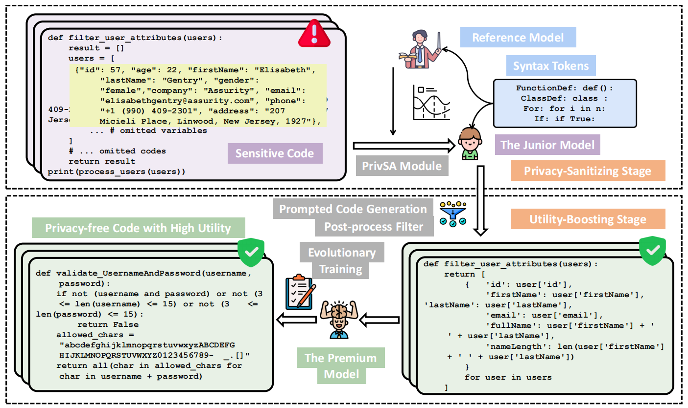

<div align=center>
  
# PrivCode: When Code Synthesis Meets Differential Privacy
</div>


This is the official implementaion of paper ***PrivCode: When Code Synthesis Meets Differential Privacy***. This repository contains Pytorch training code and evaluation code. PRIVCODE is a Differetial Privacy (DP) code synthesis tool, which leverages the DP technique to generate synthetic code, allowing organizations to share and utilize code LLMs without privacy concerns.

<div align=center>

</div>

# TO-DO

- complete the project structure.

- please clean the code structures.

- please merge the preview and master branch.

## 1. Contents

> **Note:** please adjust the contents.

- PrivCode: When Code Synthesis Meets Differential Privacy
  - [1. Contents](#1-contents)
  - [2. Project structure](#2-project-structure)
  - [3. Get Start](#3-get-start)
    - [3.1 Installation](#31-installation)
    - [3.2 Dataset](#32-dataset)
  - [4. Running Instructions](#running-instructions)
  - [5. Acknowledgment](#5-acknowledgment)


## 2. Project structure

The structure of this project is as follows:
```
data
  -- private_syn -------------------------------- the scripts of data generation and post-process filter in utility experiment
  -- pii_dataset -------------------------------- the scripts of data generation and post-process filter in PII protection experiment
  -- vulnerability ------------------------------ the scripts of data generation and post-process filter in vulnerability protection experiment
eval_bcb
  -- run_bigcodebench_step2.sh ------------------ evaluate the utility of PrivCode on BigCodeBench benchmark in utility experiment
  -- run_bigcodebench_dpbaseline_step2.sh ------- evaluate the utility of DPFT on BigCodeBench benchmark in utility experiment
  -- run_bigcodebench_infbaseline_step2.sh ------ evaluate the utility of NonDPFT on BigCodeBench benchmark in utility experiment
  -- run_bigcodebench_pretrain.sh --------------- evaluate the utility of PreCode on BigCodeBench benchmark in utility experiment
eval_evalplus
  -- run_evalplus_0.3.1_step2.sh ---------------- evaluate the utility of PrivCode and NonDPFT on EvalPlus benchmark in utility experiment
  -- run_evalplus_0.3.1_dpbaseline.sh ----------- evaluate the utility of DPFT on EvalPlus benchmark in utility experiment
  -- run_bigcodebench_pretrain.sh --------------- evaluate the utility of PreCode on EvalPlus benchmark in utility experiment
  -- run_evalplus_0.3.1_step2_ablation.sh ------- evaluate the utility of variants of PrivCode on EvalPlus benchmark in ablation experiment
  -- run_evalplus_0.3.1_step2_hyper.sh ---------- evaluate the utility of PrivCode on EvalPlus benchmark in hyper-parameter analysis experiment
-- examples ------------------------------------- util scripts and config files of training
-- fastDP --------------------------------------- differential privacy finetuning engine
pii_leaks_eval
-- detector.py ---------------------------------- PII protection evaluation benchmark
-- prompt_template.py --------------------------- template for prompts that trigger the reproduction
 of PIIs
-- run_pii_detect_step2.sh ---------------------- evaluate PrivCode’s ability to protect PIIs
-- run_pii_detect_step2_infbaseline.sh ---------- evaluate NonDPFT’s ability to protect PIIs
run_finetune
  -- run_finetune_astdp.sh ---------------------- script of privacy-sanitizing stage fine-tuning
  -- run_finetune_step2.sh ---------------------- script of utility-boosting stage fine-tuning
-- run_merge_peft ------------------------------- script of merge peft model to base model
SafeCoder
-- SafeCoder/scripts/run_sec_eval_step2.sh ------ evaluate the safe rate of PrivCode
-- SafeCoder/scripts/run_print_results_step2.sh - print the safe rate of PrivCode

```


## 3. Get Start

### 3.1 Installation

To install, clone the repository and run the following:

```bash 
git submodule update --init --recursive
pip install -r requirements_dpcode.txt
```

The code was tested on Python 3.11.

### 3.2 Dataset

We use the dataset released from [ise-uiuc/Magicoder-OSS-Instruct-75K](https://huggingface.co/datasets/ise-uiuc/Magicoder-OSS-Instruct-75K).

> **Note:** please provide a dataset structure, here; please refer to our dpimagebench paper.

> **Note:** please include how to run the baselines.


## 4. Running Instructions

> **Note:** please provide a overview here and introduce the key hyper-parameters. Besides, please provide a point-to-point experiments explanations.


### 4.1 Implementations for Results in Table 3.

#### Step1: Privacy-sanitizing Stage Fine-tuning.

```
sh run_finetune/run_finetune_astdp.sh
```

> **Note:** please introduce how to control the privacy budget.


#### Step2: Utility-boosting Stage Fine-tuning.

To generate privacy-free data, run:
```
sh data/private_syn/run_generate.sh
```

#### Step3: Synthetic Code Filtering.

For executation filter, run:
```
docker run -it --entrypoint /bin/bash code-cleaner-with-bash:latest
docker cp /data_path container_id:/app
sh data/private_syn/run_clean_data.sh
```

For round-trip filter, run:
```
sh data/private_syn/run_rt_test_prompt.sh
```

For fine-tuning without DP-SGD, run:

```
sh run_finetune/run_finetune_step2.sh
```

#### Step4: Utility Evaluation.

Compute the pass@1 rate in EvalPlus benchmark:

```
sh eval_evalplus/run_evalplus_0.3.1_step2.sh
```

Compute the pass@1 rate in BigCodeBench benchmark:

```
sh eval_bcb/run_bigcodebench_step2.sh
```

> **Note:** please show how to read the results. For best, you can provide a explanation (like, screenshot or doc) to the output of each stages.


### 4.2 PII Protection Evaluation 

> **Note:** It seems like we should delete PII protectin evaluation.


#### Privacy-sanitizing stage fine-tuning:
```
sh run_finetune/run_finetune_astdp_pii.sh
```

#### Utility-boosting stage fine-tuning:


To generate privacy-free data, run:
```
sh data/pii_dataset/privsyn/run_generate.sh
```

For executation filter, run:
```
docker run -it --entrypoint /bin/bash code-cleaner-with-bash:latest
docker cp /data_path container_id:/app
sh data/pii_dataset/privsyn/run_clean_data.sh
```

For round-trip filter, run:
```
sh data/pii_dataset/privsyn/run_rt_test_prompt.sh
```

For fine-tuning without DP-SGD, run:

```
sh run_finetune/run_finetune_step2_pii.sh
```

#### Evaluation:

```
sh pii_leaks_eval/run_pii_detect_step2.sh
```


### 4.2 Vulnerability Protection Evaluation (Implementations for Results in Table 4)

#### Privacy-sanitizing stage fine-tuning:
```
sh run_finetune/run_finetune_step2_vulnerable.sh
```

#### Utility-boosting stage fine-tuning:


To generate privacy-free data, run:
```
sh data/vulnerability/privsyn/run_generate.sh
```

For executation filter, run:
```
docker run -it --entrypoint /bin/bash code-cleaner-with-bash:latest
docker cp /data_path container_id:/app
sh data/vulnerability/privsyn/run_clean_data.sh
```

For round-trip filter, run:
```
sh data/vulnerability/privsyn/run_rt_test_prompt.sh
```

For fine-tuning without DP-SGD, run:

```
sh run_finetune/run_finetune_step2_vulnerable.sh
```


#### Evaluation:

```
docker run --gpus all -it vulnerability_eval
docker cp /model_path container_id:/app
docker cp SafeCoder container_id:/app
bash SafeCoder/scripts/run_sec_eval.sh
bash SafeCoder/scripts/run_print_results.sh
```

> **Note:** please show how to read the results. For best, you can provide a explanation (like, screenshot or doc) to the output of each stages.


### 4.3 Hyper-paramter Anlysis (Implementations for Results in Table 5)


### 4.4 Visulations

> **Note:** please edit it.

We provide the plotting codes for results visualization in the folder `plot` of DPImageBench.

- `plot_eps_change.py`: plotting for Figure 5 and 10.
- `plot_size_change.py`: plotting for Figure 6.
- `plot_wo_pretrain_cond_cifar10.py`: plotting for Figure 7.
- `plot_wo_pretrain_cond_fmnist.py`: plotting for Figure 9.
- `plot_wo_pretrain_places_imagenet.py`: plotting for Figure 8.   
- `visualization.py`: plotting for Figure 4. 

## 5. Computational Resource Requirements

All methods are implemented on a server equipped with four NVIDIA GeForce A6000 Ada GPUs and 512GB of memory. The running times of PrivCode and baselines are presented as follows.

> **Note:** please introduce training time here.


## 6. Acknowledgements

PrivCode builds upon many works and open-source codebases in both open-source LLMs and benchmarks. We would like to particularly thank the authors of:

- [DeepSeek-Coder](https://github.com/deepseek-ai/DeepSeek-Coder)
- [Qwen2.5-Coder](https://github.com/QwenLM/Qwen2.5-Coder)
- [codegemma](https://huggingface.co/google/codegemma-7b)
- [CodeQwen1.5](https://qwenlm.github.io/blog/codeqwen1.5/)
- [EvalPlus](https://github.com/evalplus/evalplus)
- [BigCodeBench](https://github.com/bigcode-project/bigcodebench)
- [pii-dataset](https://huggingface.co/datasets/bigcode/bigcode-pii-dataset)
- [SafeCoder](https://github.com/eth-sri/SafeCoder)
